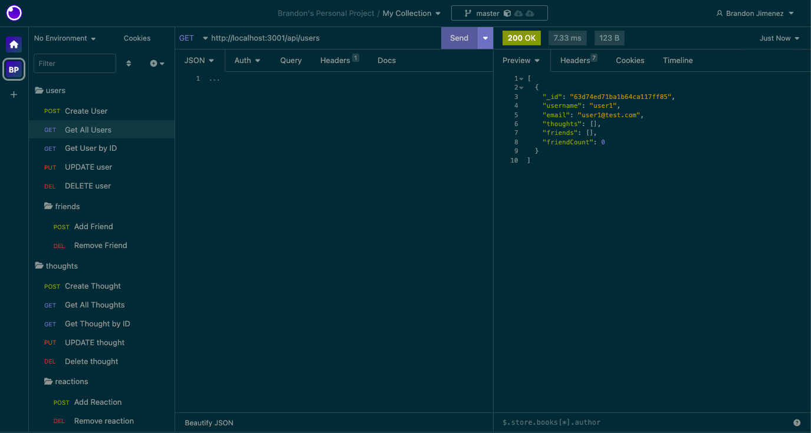

# Social-Network-API

## Description

In this challenge I created an Api for a social network web application where users can share their thoughts, react to friends’ thoughts, and create a friend list. 

## Table of Contents

- [Installation](#installation)
- [Usage](#usage)
- [Walkthrough Video](#walkthroughvideo)
- [Badges](#badges)
- [Screenshot](#screenshot)

## Installation

To run this project, install it locally using npm:
Install node.js lts

```
npm init -y
npm install
```

Additional installations (express, mongoose)

```
npm i express
npm i mongoose
```

Add script "start" which runs "node index"

## Usage

After installing npm packages, the application will be invoked by using the following command:

```
npm run start
```

Direct your browser via Insomnia  to "http://localhost:3001/"

#### Walkthrough Video

[Click here!](https://drive.google.com/file/d/1tHqU8V4KMVRzHdo02JuFvz-L8WQNRWsp/view)

## Badges


## Screenshot
